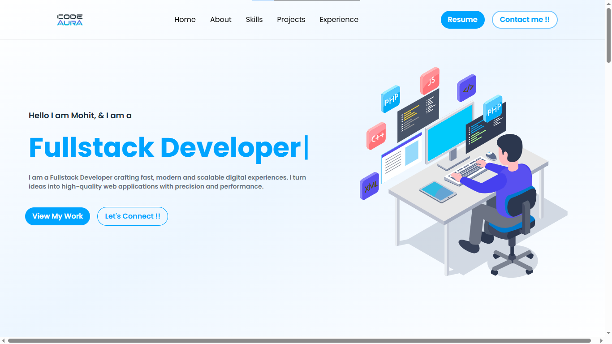
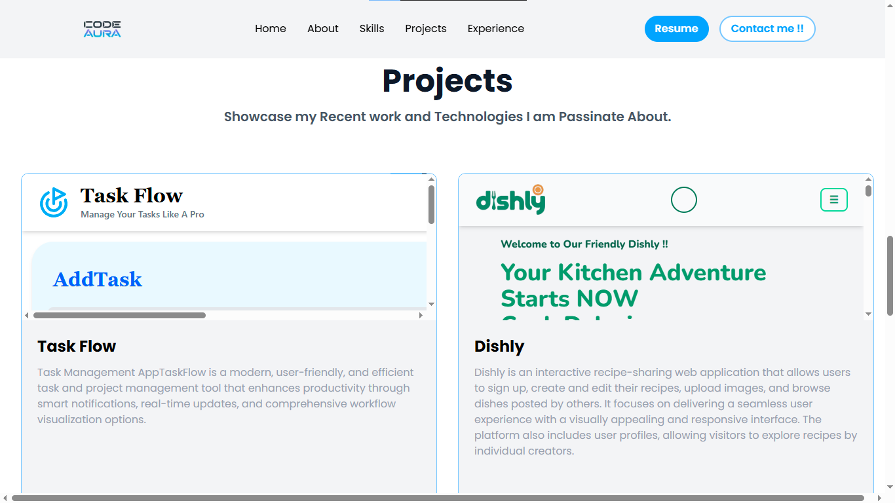
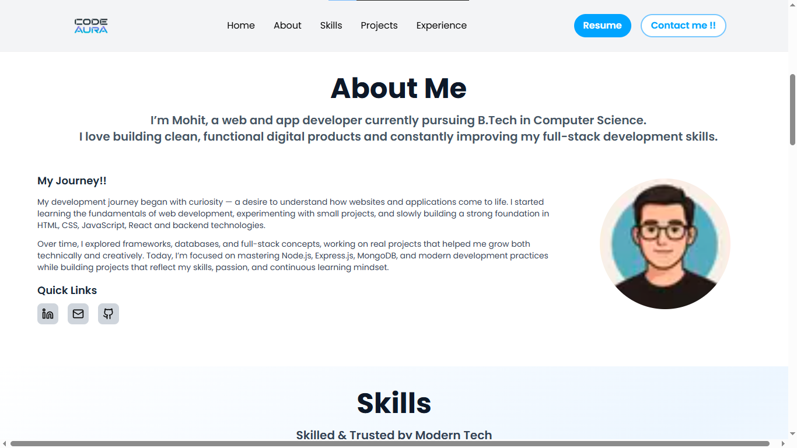
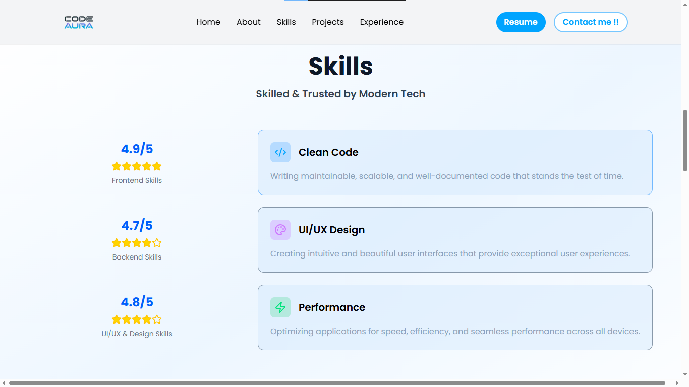
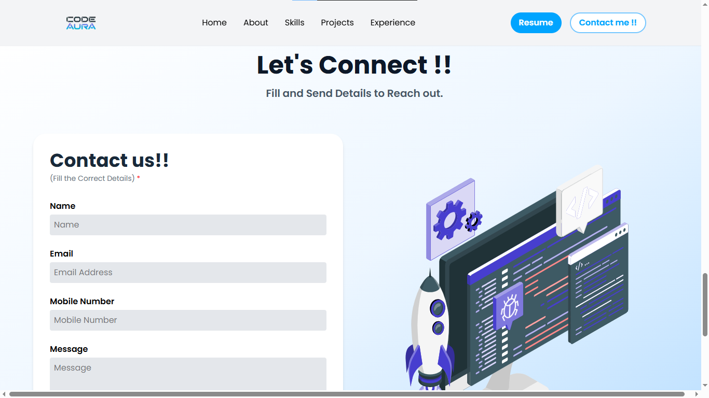

# 🌌 Code Aura — Developer Portfolio

Code Aura is a modern, full-stack developer portfolio website built to showcase projects, skills, and experience with a clean UI, smooth animations, and a functional contact system.

The project is built using **Next.js App Router**, **React 19**, and **Tailwind CSS**, with backend integrations for email handling and database support.

---

## 🚀 Live Preview
 https://code-aura-virid.vercel.app


---

## ✨ Features

- ⚡ Modern UI with smooth animations
- 🎨 Responsive, dark-themed design
- 📂 Modular component-based architecture
- 🧠 Project, Skills, Experience & About sections
- 📬 Functional Contact Form with Email support
- 🔔 Toast notifications for user feedback
- 🗄️ MongoDB-ready backend structure
- 🧩 Clean and scalable codebase

---

## 🛠️ Tech Stack

### Frontend
- **Next.js 16 (App Router)**
- **React 19**
- **Tailwind CSS v4**
- **Lottie Animations**
- **Lucide Icons**

### Backend & Utilities
- **Node.js**
- **Nodemailer** (Email handling)
- **MongoDB & Mongoose**
- **Axios**
- **dotenv**

### Tooling
- **ESLint**
- **PostCSS**
- **React Compiler (Babel)**

---

## 📁 Project Structure

```
src/
├── app/
│   ├── api/
│   │   └── contact/route.js
│   ├── layout.js
│   ├── page.js
│   └── globals.css
│
├── components/
│   ├── navbar/
│   ├── footer/
│   ├── sections/
│   │   ├── Hero.jsx
│   │   ├── About.jsx
│   │   ├── Experience.jsx
│   │   ├── Projects.jsx
│   │   ├── Skills.jsx
│   │   └── Contact.jsx
│   └── ui/
│
├── animation/
├── config/
├── lib/
├── model/
├── utils/
```

---

## ⚙️ Installation & Setup


### 1️⃣ Clone the Repository
```
git clone https://github.com/Mohit-246/CodeAura.git
cd code-aura
```

### 2️⃣ Install Dependencies
```
npm install
```

### 3️⃣ Environment Variables
- Create a .env file in the root directory:
```
**env**
MONGODB_URI=your_mongodb_connection_string
EMAIL_USER=your_email_address
EMAIL_PASS=your_email_password
```
## 4️⃣ Running the Project

- **Development**
```
npm run dev
```
- **Production Build**
```
npm run build
npm start
```


## 📬 Contact Form Flow
  - Frontend sends data using Axios
  - API route handles request
  - Email is sent via Nodemailer
  - User receives feedback via React Toastify
  - User Also Receives an Email on their corressponding email.


## 📸 Screenshots
| Home | Projects |
|------|----------|
|  |  |

| About | Skills |
|-------|---------|
|  |  |

| Contact |
|-------|
| 


## 📄 License
This project is private and intended for personal portfolio use.


## 🙌 Author
 **Mohit**
*Frontend & Full-Stack Developer*
*Building modern web experiences 🚀*


## ⭐ Support
If you like this project:

  - ⭐ Star the repo
  - 🔗 Share it
  - 💡 Fork & customize it